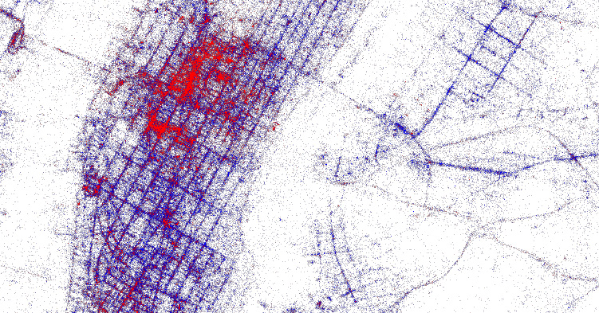

the kind of problem a city is
 

 
joao meirelles

---

where are cities coming from?
 

+++

social guathering!

---

what are cities doing?
 

+++

scaling

---

whow to make it more efficient (and fun) ?
 

+++

entropy

---
thanks
