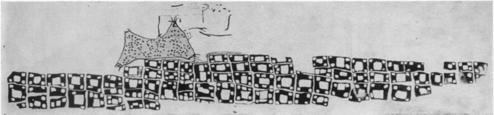
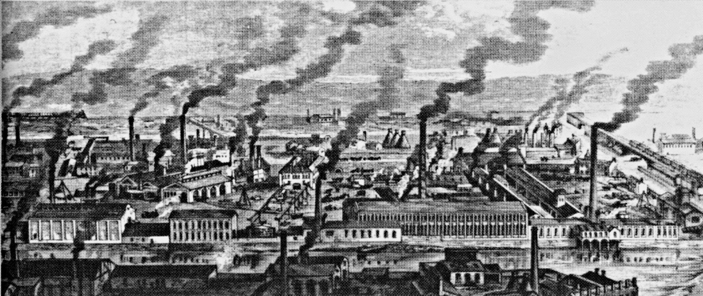

.
---

---

---
the kind of problem a city is
 

 
joao meirelles

---

where are cities coming from?
 

+++

+++
the conventional thesis
 

agriculture   ->   cities

+++
another possibility
 

cities   ->   agriculture

   çatalhöyük  

+++

cooperation
 

---

why do they grow so much?
 

+++

   yiwu / china   
+++

they can be gross

+++

but they can also be meaningful

   national organization for women - washington dc / us   

+++

science: scaling

+++
better: jane jacobs

---

whow to make better cities?
 

+++
complex systems

+++
shelling model

+++
entropy

+++
cooperation

---
thanks

#Jacobs em 69: economy of cities. 
	capitulo 1. inverte a teoria tradicional - cidades precedem agricultura.
	capitulo 2. troca dando origem as primeiras cidades 
#economia das cidades evoluem por escal e especializacao: os fenomenos co-existem 
#Densidade jacobs:z
#
#